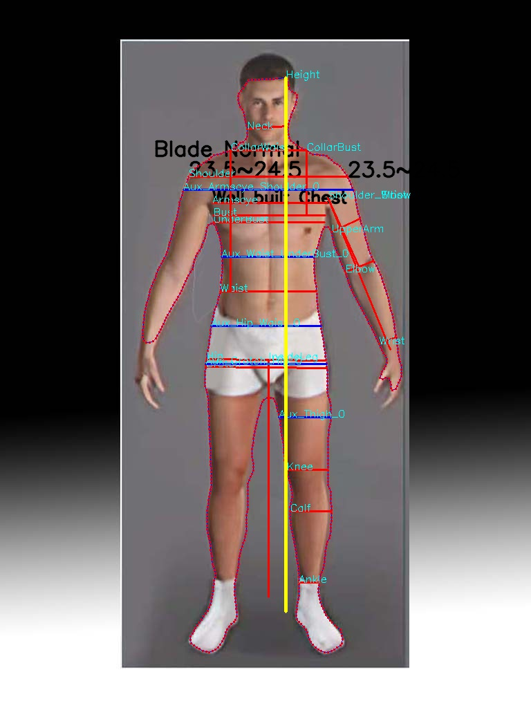
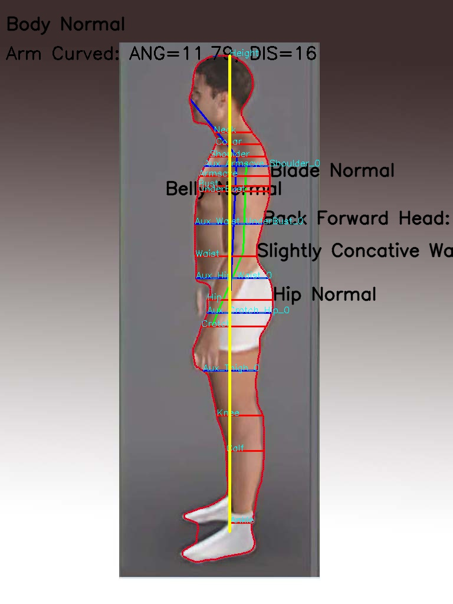

# set up environment
  * clone the code
    * git clone https://github.com/jinguo-aitech/body_type_measurement.git
  * OpenPose
    * move to the folder body_measure
    * use portable openpose for windows
      * Note: 
      I recommend NOT building OpenPose in windows.
      I tried to do it for a few days but no luck. 

  * create anaconda environment
  
        conda create -n body python=3.6
        conda install -c conda-forge opencv
        conda install tensorflow-gpu shapely matplotlib pillow scipy 
